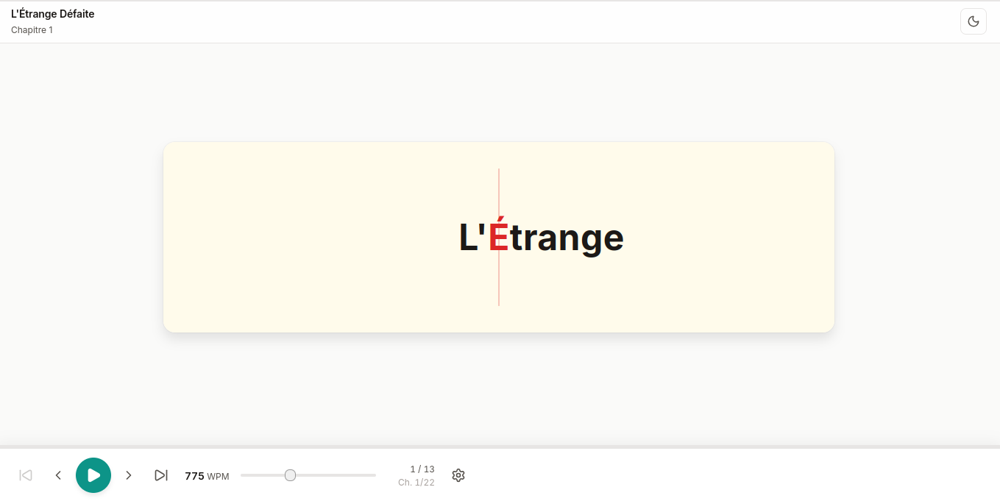
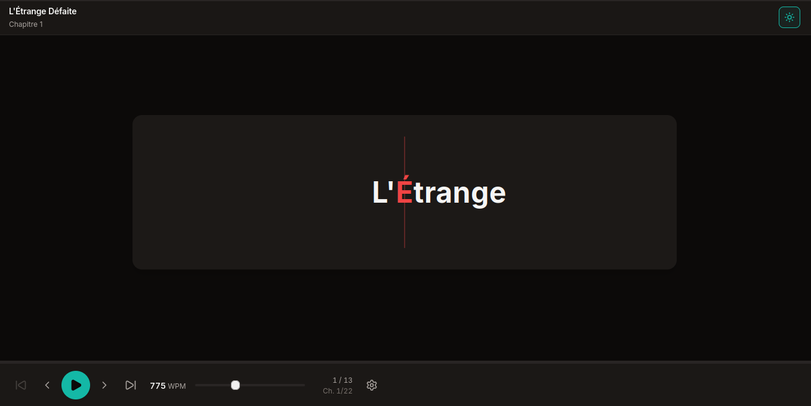
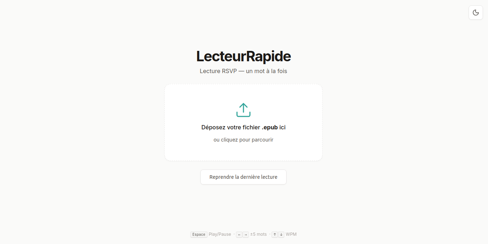
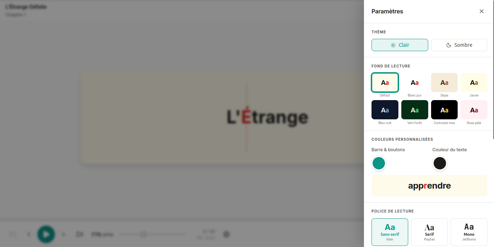
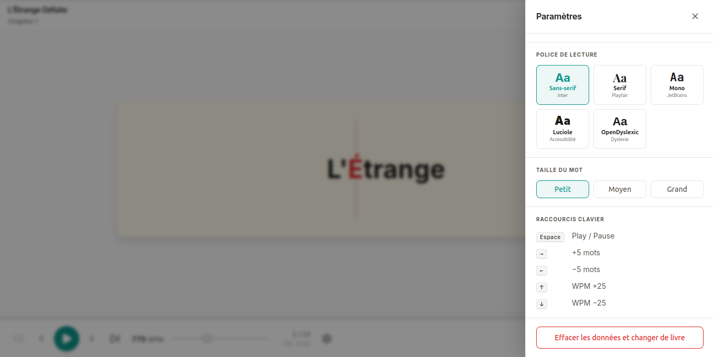

# LecteurRapide

**Lecture RSVP dans le navigateur — un mot à la fois, à votre rythme.**

LecteurRapide est une application web open source de lecture rapide par [RSVP](https://en.wikipedia.org/wiki/Rapid_serial_visual_presentation) (Rapid Serial Visual Presentation). Importez un fichier EPUB, choisissez votre vitesse, et lisez sans bouger les yeux grâce à la méthode Spritz.

[](https://lecteurrapide.vercel.app)
[](LICENSE)
[](https://react.dev)
[](https://vite.dev)
[](src/engine/rsvp.test.js)

---

## Aperçu

### Lecteur



<table>
  <tr>
    <td></td>
    <td></td>
  </tr>
  <tr>
    <td align="center"><em>Mode clair</em></td>
    <td align="center"><em>Mode sombre</em></td>
  </tr>
</table>

### Import



### Paramètres

<table>
  <tr>
    <td></td>
    <td></td>
  </tr>
  <tr>
    <td align="center"><em>Thème, palettes & couleurs personnalisées</em></td>
    <td align="center"><em>Polices, taille du mot & raccourcis clavier</em></td>
  </tr>
</table>

---

## Fonctionnalités

- **Import EPUB** — glisser-déposer ou clic, analyse automatique des chapitres
- **Moteur RSVP / Spritz** — affichage mot par mot avec la lettre pivot (ORP) en rouge pour ancrer le regard
- **Vitesse réglable** — de 100 à 2 000 mots par minute, slider + raccourcis clavier
- **Délais de ponctuation** — pauses automatiques aux virgules, points, tirets, etc.
- **Navigation** — barre de progression cliquable, saut de ±5 mots, navigation entre chapitres
- **Thèmes** — mode clair / sombre
- **8 palettes de lecture** — défaut, blanc pur, sépia, jaune, bleu nuit, vert forêt, contraste max, rose pâle
- **Couleurs personnalisées** — sélecteur natif pour la couleur de la barre et du texte
- **5 polices** — Inter, Playfair, JetBrains Mono, Luciole (malvoyants), OpenDyslexic (dyslexie)
- **3 tailles de mot** — petit, moyen, grand
- **Persistance locale** — reprise automatique à l'endroit exact où vous vous êtes arrêté
- **100% local** — aucune donnée envoyée, tout reste dans votre navigateur

### Raccourcis clavier

| Touche | Action |
|--------|--------|
| `Espace` | Play / Pause |
| `→` | +5 mots |
| `←` | −5 mots |
| `↑` | +25 WPM |
| `↓` | −25 WPM |

---

## 🚀 Essayer sans installer

**[→ Ouvrir la démo live](https://lecteurrapide.vercel.app)**

Aucune installation requise — fonctionne dans le navigateur, vos fichiers restent sur votre machine.

---

## Démarrage rapide

```bash
git clone https://github.com/ThomasSORET/lecteurrapide.git
cd lecteurrapide
npm install
npm run dev
```

Ouvrez [http://localhost:5173](http://localhost:5173) dans votre navigateur.

### Build de production

```bash
npm run build   # génère dist/
```

### Tests

```bash
npm test        # 47 tests unitaires
```

---

## Stack technique

| Outil | Rôle |
|-------|------|
| [React 19](https://react.dev) | Interface |
| [Vite 8](https://vite.dev) | Build & dev server |
| [epubjs](https://github.com/futurepress/epub.js) | Parsing EPUB |
| [Lucide React](https://lucide.dev) | Icônes |
| [Vitest](https://vitest.dev) | Tests unitaires |
| CSS Modules | Styles scopés |

Architecture : `useReducer` + Context API — aucune lib de state externe.

---

## Licence

[MIT](LICENSE) © 2026 Thomas SORET

Les polices tierces ont leurs propres licences :
- **Luciole** — [CC BY 4.0](https://github.com/Laurent-Bou/Luciole) — Laurent Bou / BrailleNet
- **OpenDyslexic** — [Bitstream Vera License](https://opendyslexic.org) — Abbie Gonzalez
- **Inter, Playfair Display, JetBrains Mono** — [SIL OFL](https://scripts.sil.org/OFL)
